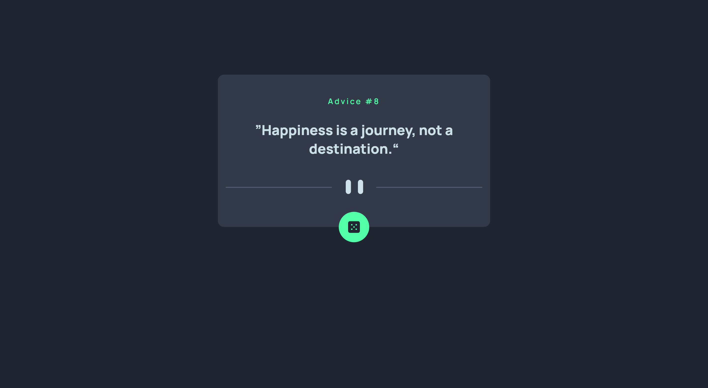

# Frontend Mentor - Advice generator app solution

This is a solution to the [Advice generator app challenge on Frontend Mentor](https://www.frontendmentor.io/challenges/advice-generator-app-QdUG-13db). Frontend Mentor challenges help you improve your coding skills by building realistic projects.

## Table of contents

- [Overview](#overview)
  - [The challenge](#the-challenge)
  - [Screenshot](#screenshot)
  - [Links](#links)
- [My process](#my-process)
  - [Built with](#built-with)
  - [What I learned](#what-i-learned)
- [Author](#author)

## Overview

### The challenge

Users should be able to:

- View the optimal layout for the app depending on their device's screen size
- See hover states for all interactive elements on the page
- Generate a new piece of advice by clicking the dice icon

### Screenshot

### Links

- [Solution URL](https://github.com/mostafa-meerzad/advice-generator)
- [Live Site URL](https://clinquant-tarsier-161c51.netlify.app/)

## My process

### Built with

- Semantic HTML5 markup
- CSS custom properties
- HTML custom attributes
- Flexbox
- CSS Grid
- Mobile-first workflow
- [React](https://reactjs.org/) - JS library
- [Next.js](https://nextjs.org/) - React framework
- [Styled Components](https://styled-components.com/) - For styles

### What I learned
How to control Framer-motion animations 
fetching data from an external API

## Author

- Linkedin - [mostafa-meerzad](https://www.linkedin.com/in/mostafa-meerzad-a753371b7/)
- Frontend Mentor - [mostafa-meerzad](https://www.frontendmentor.io/profile/mostafa-meerzad)
